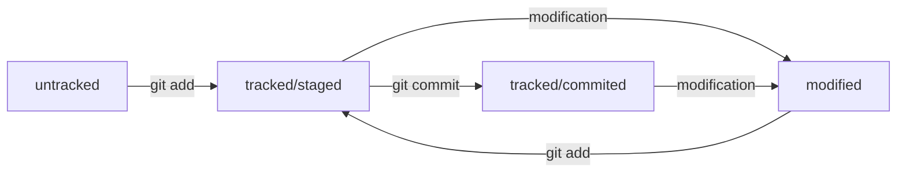

# Шпаргалка по Git

## Основные команды
* `git init` - Инициализировать репозиторий.
* `git add <files>` - Подготовить файл(-ы) к коммиту.
* `git commit -m <message>` - Создать коммит с сообщением `<message>`.
* `git status` - Проверить состояние репозитория.
* `git log` - Посмотреть историю коммитов.
* `git remote add <remote-repository-name> <remote-repository-url>` - Связать имеющийся репозиторий с удаленным, присвоить ему имя `<remote-repository-name>`.
* `git remote -v` - Посмотреть список связанных репозиториев.
* `git push` - Отправить локальные коммиты в удаленный репозиторий. При первом коммите необходимо добавить флаг `-u <remote-repository-name> <remote-repository-branch>`, где
    1. `<remote-repository-name>` - имя удаленного репозитория
    2. `<remote-repository-branch>` - название ветки в удаленном репозитории
* `git clone <remote-repository-url>` - Скачать удаленный репозиторий в рабочий каталог.
* `git log [--oneline]` - Вывести историю коммитов. Описание вывода:
    1. `commit` - хеш коммита (SHA-1)
    2. `Author` - автор коммита и его электронная почта в угловых скобках
    3. `Date` - дата и время коммита
    4. сообщение коммита
    * при передаче флага `--oneline` коммит выводится в сокращенном виде 'хеш сообщение'
## Статусы файлов

## Внутренняя работа Git

* `HEAD` - файл, содержащий ссылку на файл `refs/heads/<название ветки>`. Находится в папке `.git`
* `refs/heads/<название ветки>` - файл, содержащий хеш последнего коммита. Находится в папке `.git`